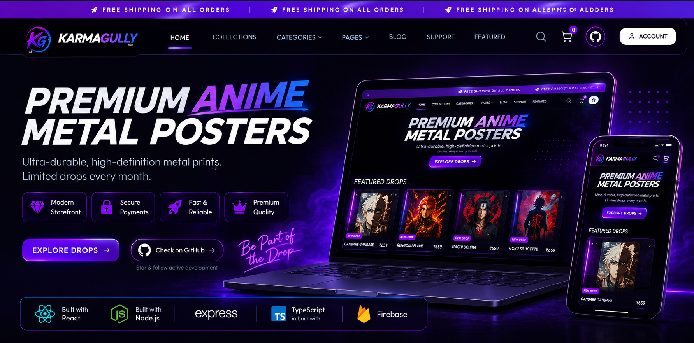

<div align="center">
  
</div>


<div align="center">


</div>

<p align="center">


</p>

<div align="center">

[ Live Website](https://karmagully.studio) •
[ Star Repository](https://github.com/contactkarmagully-star/KarmaGully) •
[ Report Bug](https://github.com/contactkarmagully-star/KarmaGully/issues) •
[ Request Feature](https://github.com/contactkarmagully-star/KarmaGully/issues)


</div>


<p align="center">
  
</p>


# KarmaGully

**AI-Powered E-Commerce Platform for Premium Anime Metal Posters**

Modern e-commerce platform featuring AI-powered blog generation, SEO automation, loyalty rewards, customer support ticketing, delivery tracking, and a powerful admin dashboard.

🌐 **Website:** https://karmagully.studio

---
 Homepage

<p align="center">
  
</p>

 Product Details

<p align="center">
  
</p>

Experience every detail before you buy—from high-resolution previews and multiple size options to detailed specifications and a seamless add-to-cart experience.


---


##  Run Locally

### Prerequisites

- Node.js 20+
- Firebase Project
- Cloudinary Account
- Google AI API Key *(Optional - Required for AI Blog Generator)*
- Telegram Bot *(Optional - Admin Notifications)*
- Razorpay Account *(Optional - Online Payments)*

### Installation

```bash
git clone https://github.com/contactkarmagully-star/KarmaGully.git
cd KarmaGully
npm install
```

---

##  Environment Setup

This project uses environment variables for Firebase, Cloudinary, Google AI, Razorpay, and Telegram integration.

Copy the example environment file:

```bash
cp .env.example .env.local
```

Open `.env.local` and replace the placeholder values with your own credentials.

> **Note:** AI Blog Generator, Telegram notifications, and Online Payments require their respective API keys. Refer to `.env.example` for the complete list of environment variables.

---

##  Start the Development Server

```bash
npm run dev
```

---

##  Built With

-  React
-  TypeScript
-  Node.js
-  Express.js
-  Firebase
-  Cloudinary
-  Razorpay
-  Google AI (Gemini)

---

##  Key Features

-  Modern Anime E-Commerce Store
-  AI-Powered SEO Blog Generator
-  Product & Order Management
-  Coupon Management
-  Loyalty & Rewards System
-  Customer Support Ticket System
-  Delivery Partner Tracking
-  Telegram Order Notifications
-  Secure Authentication
-  Fully Responsive Design

---

## 🌐 Live Demo

https://karmagully.studio

---

## 📄 License

This project is licensed under the MIT License.


<div align="center">

Made with ❤️ using React, TypeScript, Node.js & Firebase.

If you like this project, consider giving it a Star

</div>
<p align="center">
  
</p>

